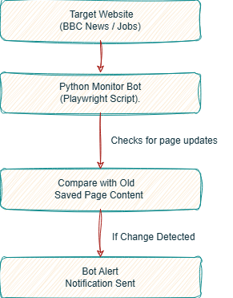
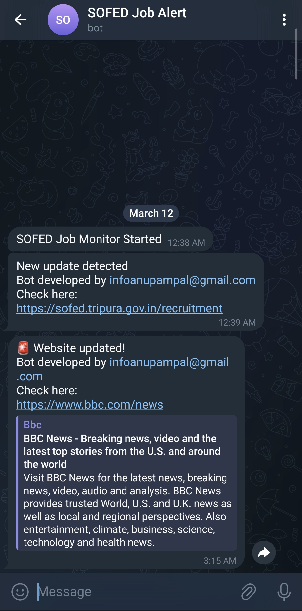

<h1 align="center">
🤖 Website Monitor Bot 🤖
</h1>

## Project Overview
This project is a simple **Website Monitoring Bot** built with Python.
The bot automatically checks a website for updates and sends a **Notification** whenever a change is detected.
It can be used to monitor:
* Job notification pages
* Government announcement portals
* News websites
* Any webpage that gets updated regularly

---
## Features
* Automatic website monitoring
* Detects content updates on webpages
* Sends instant notifications
* Runs automatically using GitHub Actions
* Supports monitoring dynamic websites using Playwright
---
## Tech Stack
* **Python** – Main programming language used to build the bot
* **Playwright** – Headless browser automation for loading dynamic webpages
* **Requests** – Used for sending messages through the Bot API
* **Bot API** – Sends alert notifications
* **GitHub Actions** – Automates the script execution on a schedule
---
## How It Works
1. The bot opens the target website using Playwright.
2. It collects the full webpage content.
3. The content is saved locally in a file.
4. When the script runs again, it compares the new webpage content with the previous version.
5. If any change is detected, a Telegram message is sent to the user.
6. The new content replaces the old content for future comparison.
---

## Workflow / Output

---

## Example Use Case
This bot can monitor pages like:
* Job recruitment portals
* News websites (e.g., BBC News)
* Government notification pages
* University result announcements

## Future Improvements
Possible improvements for this project:
* Monitor multiple websites simultaneously
* Detect only specific sections of a webpage
* Send detailed update summaries
* Store change history in a database

<h5 align="center">
This project was developed as part of my learning journey in Python automation and web monitoring. As a learning assistant to understand concepts and structure the code took help of GPT Models. The final implementation, testing, and project setup were completed by "infoanupampal@gmail.com"
</h5>
